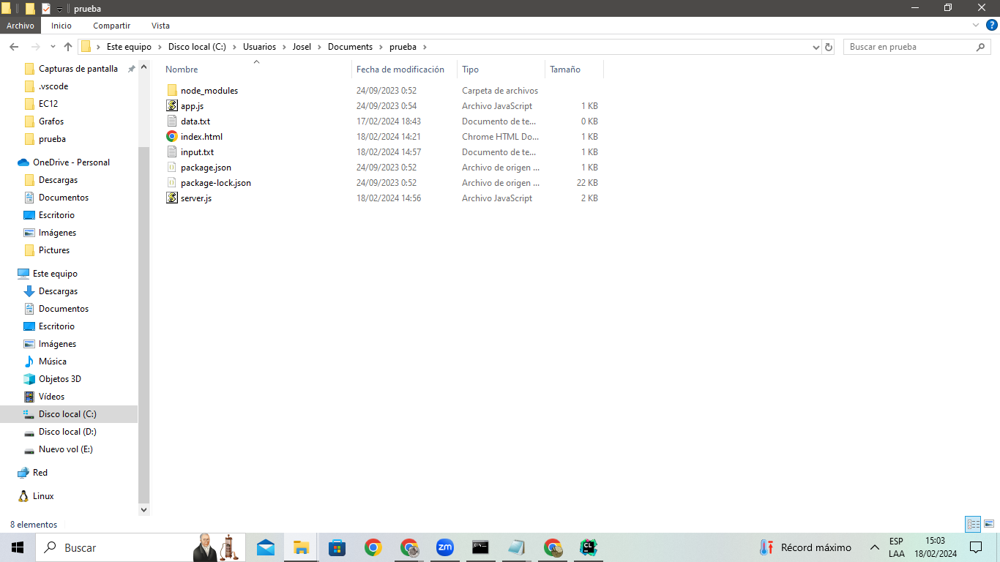

# Gomory-Hu-Tree
Gomory-Hu Tree implementation

forma de correr:

carpeta donde estan el index html y el server, ambos deben estar en la misma carpeta para que funcione, tmb se guarda ahi el input, en el clion decidi trabajar con la version que se descarga automaticamente.

