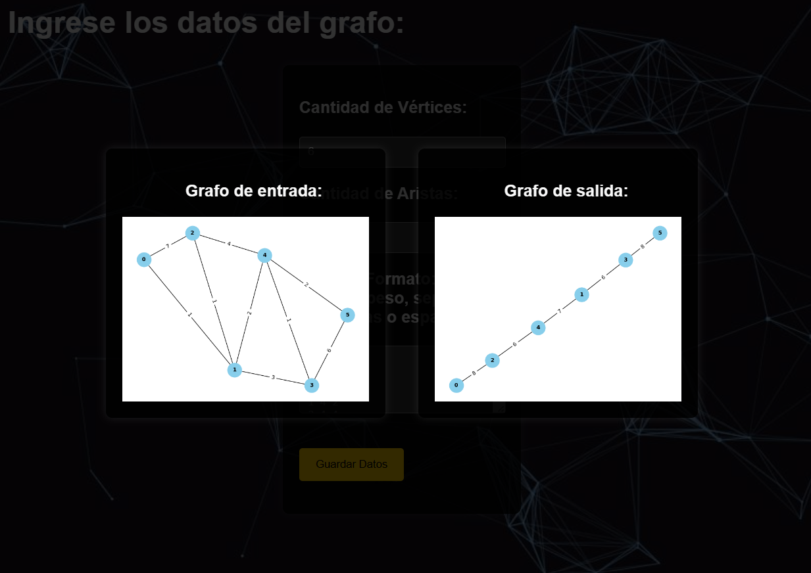

# Gomory-Hu-Tree
Gomory-Hu Tree implementation
## Ejecución de la interfaz gráfica:
1.- Clonar el repositorio desde la ubicación que deseas tener el proyecto.

2.- Abrir el proyecto en Visual Studio Code.

3.- Cambiamos la ruta dentro del html, para que nos pueda aparecer el fondo de nuestro html.

4.- Abrimos el html y llenamos los datos solicitados.

5.- Ejecutamos el InterfaceHelper.py, esto nos ayudará a mover el archivo que nos descargo el html a nuestra carpeta de proyecto.

6.- Ejecutamos el archivo GomoryHuTree.cpp para generar el .exe y el output.txt que necesitara nuestro programa para graficar.

7.- Ejecutamos el archivo GraphicInterface.py para que el programa pueda dibujar nuestro grafo original y nuestro Gomory Hu, nos devolvera dos txt y dos imagenes(grafo original,grafo con Gomory Hu) en formato png.

