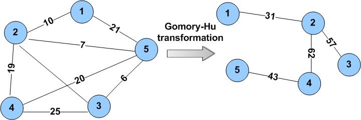

# Gomory-Hu-Tree

Gomory-Hu Tree implementation

## Integrantes:

- Fabryzzio Jossue Meza Torres
- Fernando Alonso Usurin Arias
- Yoselyn Victoria Miranda Chirinos

## Ejecución de la interfaz gráfica:

1.- Clonar el repositorio en la ubicación donde se desea tener el proyecto.

2.- Para correr la interfaz grafica es necesario cambiar las rutas en los archivos server.py, GraphicInterface.py y GomoryHuTree.cpp, se muestran imagenes referenciales:
server.py:

GraphicInterface.py

GomoryHuTree.cpp

4.- Despues de cambiar las rutas correctamente en todos los archivos mencionados, ejecutamos server.py para desplegar nuestro servidor de Flask.

5.- Luego entramos en la carpeta del proyecto donde lo hallamos clonado, entramos a la carpeta llamda html, y ejecutamos prueba.html. Al realizar ello, se nos mostrará la interfaz grafica, pidiendonos datos del grafo a ingresar.Despues de agregar los datos en el formato requerido enviamos nuestros datos.

6.- La interfaz enviará un mensaje de que el grafo de entrada a sido recibido y graficará tanto el grafo original como su Gomory Hu Tree correspondiente.

