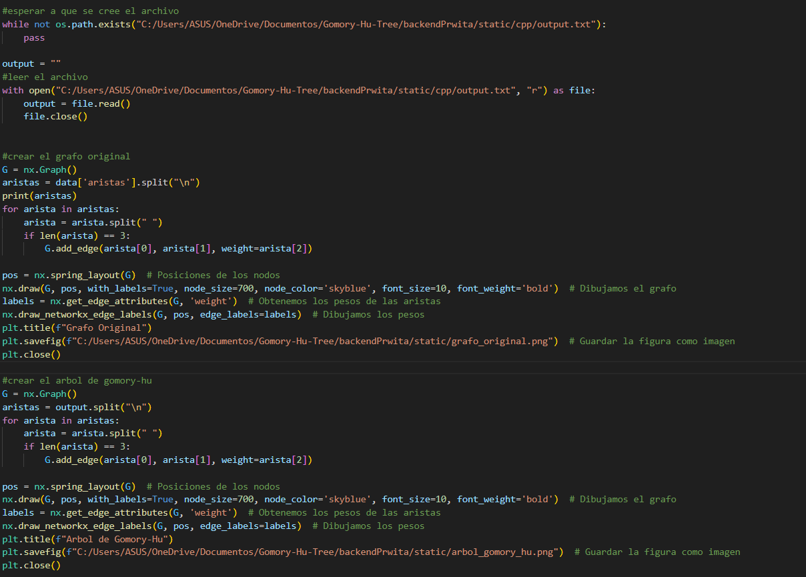

# Gomory-Hu-Tree

Gomory-Hu Tree implementation

## Integrantes:

- Fabryzzio Jossue Meza Torres
- Fernando Alonso Usurin Arias
- Yoselyn Victoria Miranda Chirinos

## Ejecución de la interfaz gráfica:

1.- Clonar el repositorio desde la ubicación que deseas tener el proyecto.

2.- Abrir el proyecto en Visual Studio Code.

3.- Cambiamos la ruta dentro del python y c++ para que cuando se ejecute se muestre el fondo.

4.- Corremos el servidor, es decir, server.py

5.- Abrimos el html y llenamos los datos solicitados. Para luego poder presionar el boton de enviar los datos

6.- Automaticamente se generaría nuestros graficos, tanto del grafo cómo dle arbol 

